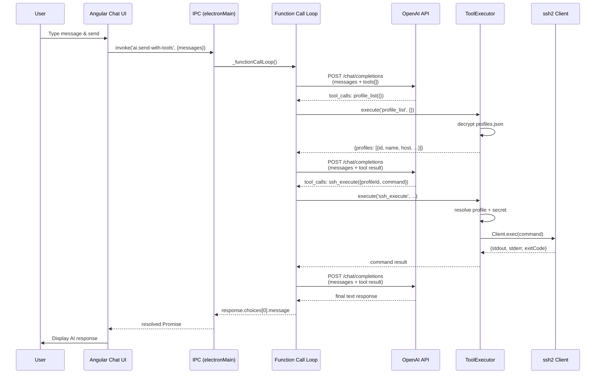

# YAET AI Integration Architecture

> How YAET exposes its capabilities to AI Agents via MCP and ACP protocols.

---

## Architecture Overview

`
┌──────────────────────────────────────────────────────────────────┐
│                     YAET (Electron App)                          │
│                                                                  │
│  ┌──────────────────┐    ┌──────────────────────────────────┐   │
│  │   Angular UI     │◄──►│   IPC Handlers (Electron Adapter) │   │
│  │   (Renderer)     │    │   ssh / telnet / vnc / scp / ... │   │
│  └──────────────────┘    └─────────────┬────────────────────┘   │
│                                        │                         │
│  ┌─────────────────────────────────────▼─────────────────────┐  │
│  │                  Service Layer                             │  │
│  │        (Pure Node.js — No Electron Dependency)              │  │
│  │                                                             │  │
│  │  ┌────────────┐ ┌──────────┐ ┌──────────┐ ┌────────────┐  │  │
│  │  │ SSHService │ │SCPService│ │FTPService│ │VNCService  │  │  │
│  │  ├────────────┤ ├──────────┤ ├──────────┤ ├────────────┤  │  │
│  │  │ connect()  │ │listFiles │ │listFiles │ │startProxy()│  │  │
│  │  │ write()    │ │readFile()│ │readFile()│ │stopProxy() │  │  │
│  │  │ disconnect │ │writeFile │ │writeFile │ │            │  │  │
│  │  └────────────┘ └──────────┘ └──────────┘ └────────────┘  │  │
│  │                                                             │  │
│  │  ┌──────────────┐ ┌──────────────┐ ┌──────────────────┐   │  │
│  │  │ProxyService  │ │ConfigService │ │CloudService      │   │  │
│  │  │HTTP/SOCKS    │ │JSON load/save│ │Git sync          │   │  │
│  │  └──────────────┘ └──────────────┘ └──────────────────┘   │  │
│  └─────────────────────────┬─────────────────────────────────┘  │
└────────────────────────────┼───────────────────────────────────┘
                             │
              ┌──────────────┼──────────────┐
              ▼              ▼              ▼
     ┌────────────┐  ┌────────────┐  ┌────────────┐
     │IPC Handlers│  │ MCP Server │  │ ACP Server │
     │(Electron)  │  │ (stdio)    │  │(stdin/stdout)
     └────────────┘  └────────────┘  └────────────┘
                           │                │
                           ▼                ▼
                    Claude Desktop    opencode /
                    (MCP Client)      ACP Agents
`

## How It Works

### 1. Service Layer (\src-electron/services/\)

The core business logic, implemented as plain Node.js classes with \EventEmitter\. **Zero Electron dependencies** — no \ipcMain\, no \BrowserWindow\, no \
equire('electron')\.

Each service:
- Accepts a \log\ object (any logger with \.info()\, \.warn()\, \.error()\)
- Exposes async methods for its operations
- Emits events for streaming output (\'output'\, \'error'\, \'disconnect'\)
- Manages its own session/connection pool

Example interface:

\\\js
class SSHService extends EventEmitter {
  async connect(config, options) → session
  disconnect(id)
  write(id, data)
  resize(id, cols, rows)

  // events:
  // 'output'   → { id, data }
  // 'error'    → { id, error }
  // 'disconnect' → { id, error? }
}
\\\

### 2. IPC Handlers (\src-electron/ipc/\)

Thin adapters that bridge the Service Layer to Electron's IPC system. Each handler:
- Creates a service instance
- Listens for service events and forwards them to the renderer via \event.sender.send()\
- Translates IPC calls (\ipcMain.on\ / \ipcMain.handle\) into service method calls

\\\js
sshService.on('output', ({ id, data }) => {
  sessionSenders.get(id)?.send('terminal.output', { id, data });
});
\\\

### 3. MCP Server (\src-protocol/mcp/\)

Implements the **Model Context Protocol** (JSON-RPC 2.0 over stdio), exposing YAET capabilities as MCP **Tools**.

Protocol methods:
| Method | Description |
|---|---|
| \initialize\ | Version negotiation, capability declaration |
| \	ools/list\ | Returns all tool schemas |
| \	ools/call\ | Invokes a tool with given arguments |

Available tools:
| Tool | Service Used | Description |
|---|---|---|
| \ssh_execute\ | SSHService | Execute command on remote server |
| \ssh_connect_interactive\ | SSHService | Open interactive SSH session |
| \ssh_send_input\ | SSHService | Send input to interactive session |
| \ssh_disconnect\ | SSHService | Disconnect SSH session |
| \scp_list_files\ | SCPService | List remote directory |
| \scp_read_file\ | SCPService | Read remote file content |
| \scp_write_file\ | SCPService | Write file to remote server |
| \scp_delete_file\ | SCPService | Delete remote file |
| \local_execute\ | LocalTerminalService | Execute local command |

### 4. ACP Server (\src-protocol/acp/\)

Implements the **Agent Communication Protocol**, allowing ACP-compatible agents to create sessions and call tools.

Protocol methods:
| Method | Description |
|---|---|
| \initialize\ | Protocol initialization |
| \session/new\ | Create a new session |
| \session/prompt\ | Send a prompt to a session |
| \session/close\ | Close a session |
| \	ools/list\ | List available tools |
| \	ools/call\ | Call a specific tool |

### 5. AI Chat Function Calling

> Built-in AI Chat supports OpenAI-compatible function calling, allowing the AI to directly execute remote operations via saved profiles — no credentials exposed to the AI.



#### AI Tools (5)

| Tool | Parameters | Service Used | Description |
|---|---|---|---|
| `profile_list` | `keyword?` | ConfigService | List/search saved profiles by name or host |
| `ssh_execute` | `profileId, command` | ssh2 Client.exec() | Execute command on remote server |
| `scp_list_files` | `profileId, path` | SCPService | List remote directory entries |
| `scp_read_file` | `profileId, path` | SCPService | Read remote file content |
| `scp_write_file` | `profileId, path, content` | SCPService | Write content to remote file |

#### Security Model

**Only IDs cross the process boundary — never plaintext credentials.**

```
   ┌─ Angular (Renderer) ──────────────────────────┐
   │  messages: ["check disk on web-server"]       │
   │  AI sees: profile_list → [{id:"abc",          │  ← 只有 id，无 host/login/密码
   │                           name:"web-server"}] │
   │  AI calls: ssh_execute({profileId:"abc",      │  ← 只有 profileId
   │                          command:"df -h"})    │
   └───────────────────────────────────────────────┘
                         │ IPC (安全通道)
                         ▼
   ┌─ Electron Main Process ───────────────────────┐
   │  ToolExecutor:                                 │
   │    1. reads ~/.yaet/profiles.json              │  ← 加密存储
   │    2. decrypts with master key (keytar)        │  ← OS 密钥链
   │    3. finds profile by ID                      │
   │    4. resolves secretId → secrets.json         │  ← 加密存储
   │    5. decrypts secret → login/password/key     │
   │    6. ssh2 Client.exec(config)                 │  ← 凭据仅在主进程内存中
   │    7. returns {stdout, stderr} only            │  ← 无凭据泄漏
   └───────────────────────────────────────────────┘
```

Key guarantees:

- **AI 永远看不到明文凭据** — 它只知道 `profileId`，不知道 host/port/username/password/privateKey
- **Angular renderer 也看不到** — profile_list 返回的安全字段只包含 `{id, name, type, host, port}`，不包含 login/password/secretId
- **凭据仅在主进程内存中存在** — ToolExecutor 解密后用完即丢，不持久化、不序列化、不回传 renderer
- **加密存储** — `profiles.json` 和 `secrets.json` 使用 AES + master key (OS keychain via keytar) 加密
- **AI 无法直接访问** — 即使 AI 被注入恶意 prompt，它能调的工具只有 5 个，参数只有 profileId + command，无法枚举 secretId 或直接读取文件
- **No proxy support** in v1 — SSH/SCP connections are direct

## Running the Server

\\\ash
# MCP Server (for Claude Desktop)
npm run mcp

# ACP Server (for ACP-compatible agents)
npm run acp
\\\

## Claude Desktop Configuration

Add to your \claude_desktop_config.json\:

\\\json
{
  "mcpServers": {
    "yaet": {
      "command": "node",
      "args": ["C:/path/to/yaet/src-protocol/cli.js", "mcp"]
    }
  }
}
\\\

After configuration, Claude can directly execute commands on your servers:
- "SSH into my production server and check disk usage"
- "List the files in /var/log on the web server"
- "Read the nginx config file from the remote server"

## Service Catalog

| Service | File | Capabilities |
|---|---|---|
| \SSHService\ | \services/sshService.js\ | SSH connect, command execution, interactive shell |
| \TelnetService\ | \services/telnetService.js\ | Telnet connect, send, login prompt detection |
| \WinRMService\ | \services/winrmService.js\ | WinRM via PowerShell PSSession |
| \LocalTerminalService\ | \services/localTerminalService.js\ | Local shell via node-pty |
| \SCPService\ | \services/scpService.js\ | SFTP list, read, write, delete, copy, move |
| \FTPService\ | \services/ftpService.js\ | FTP list, read, write, delete, copy, move |
| \SambaService\ | \services/sambaService.js\ | SMB list, read, write, delete, copy |
| \VNCService\ | \services/vncService.js\ | WebSocket VNC proxy server |
| \ProxyService\ | \services/proxyService.js\ | HTTP CONNECT + SOCKS4/5 proxy tunnels |
| \ConfigService\ | \services/configService.js\ | JSON config read/write, manifest management |
| \CloudService\ | \services/cloudService.js\ | Git-based cloud sync of profiles/secrets |

## Design Principles

1. **Services are Electron-free** — can run in any Node.js process (Electron, standalone CLI, Docker)
2. **IPC handlers are thin** — only translate between Electron IPC and Service APIs
3. **Protocol servers are stateless** — each request creates/uses a service instance
4. **Backward compatible** — existing Electron UI continues to work unchanged
