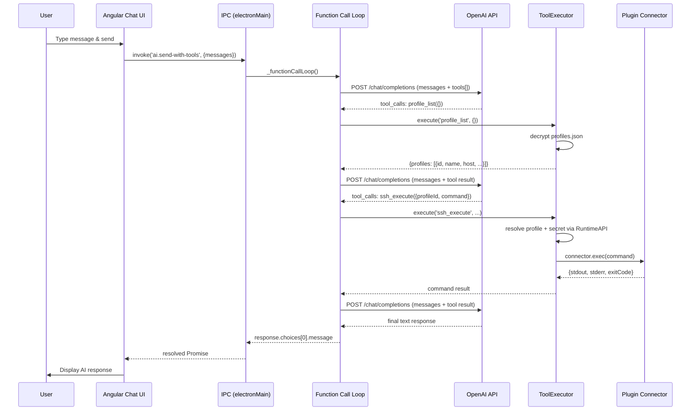

# YAET AI Integration Architecture

> How YAET exposes its capabilities to AI Agents via MCP, ACP, and built-in AI Chat.
> Last updated: 2026-08-30

---

## Architecture Overview

YAET uses a **4-layer architecture** that separates concerns and enables multi-protocol access:

```
┌─────────────────────────────────────────────────────────────────┐
│                    Interface Layer (Adapters)                    │
│  ┌──────────┐  ┌──────────┐  ┌──────────┐  ┌──────────────┐   │
│  │ Electron  │  │AI Chat   │  │MCP Server│  │ACP Server    │   │
│  │ IPC Adapter│ │(33 tools)│  │(stdio)   │  │(stdin/stdout)│   │
│  └─────┬─────┘  └─────┬────┘  └─────┬────┘  └──────┬───────┘   │
│        └───────────────┴─────────────┴──────────────┘           │
├─────────────────────────────────────────────────────────────────┤
│                    Runtime Layer (Logic)                         │
│  ┌────────────┐ ┌───────────────┐ ┌──────────────────────┐     │
│  │ RuntimeAPI │ │SessionRegistry│ │ApprovalManager       │     │
│  │(facade)    │ │(AI context)   │ │(command approval)    │     │
│  └─────┬──────┘ └───────────────┘ └──────────────────────┘     │
├─────────────────────────────────────────────────────────────────┤
│                    Plugin Layer (Connectors)                     │
│  ┌──────┐┌──────┐┌──────┐┌──────┐┌─────┐┌─────┐┌─────┐       │
│  │ SSH  ││Telnet││WinRM ││Serial││SCP  ││FTP  ││VNC  │ ...   │
│  └──────┘└──────┘└──────┘└──────┘└─────┘└─────┘└─────┘       │
├─────────────────────────────────────────────────────────────────┤
│                    Services Layer (Infrastructure)               │
│  ┌────────────┐ ┌────────────┐ ┌────────────┐ ┌────────────┐  │
│  │ConfigService│ │SecuritySvc │ │ProxyService│ │CloudService│  │
│  │JSON I/O     │ │Encryption  │ │SOCKS/HTTP  │ │Git sync    │  │
│  └────────────┘ └────────────┘ └────────────┘ └────────────┘  │
└─────────────────────────────────────────────────────────────────┘
```

### Design Principles

1. **Runtime Layer has zero Electron dependency** — shared by all Adapters
2. **Plugin Layer makes all connectors interchangeable** — each connection type is an independent plugin
3. **Adapter is a thin protocol bridge** — one Adapter per protocol/interface
4. **Adapters are independent** — adding a new protocol means adding a new Adapter
5. **`runtimeAPI.getConnector(profileId, opts)`** is the unified factory; empty `profileId` returns a `LocalTerminalSession`
6. **Credentials never exposed to AI** — `listProfiles()` returns only `{id, name, type, host, port}`

---

## Layer Details

### 1. Runtime Layer (`src-electron/runtime/`)

The core business logic, implemented as plain Node.js classes. **Zero Electron dependencies** — no `ipcMain`, no `BrowserWindow`, no `require('electron')`.

```
runtime/
├── runtimeAPI.js              ← Facade: listProfiles(), getConnector(), _resolveRemoteConfig()
├── sessionRegistry.js         ← Session tracking + output buffering for AI context
├── approvalManager.js         ← AI command approval (dangerous command detection)
├── connectors/
│   └── terminal/
│       └── local.js           ← Local terminal (node-pty) — only non-plugin connector
└── interfaces/
    ├── terminalRuntimeApi.js  ← Base class: connect(), write(), resize(), close(), exec()
    ├── fileExplorerRuntimeApi.js ← Base class: listFiles(), readFile(), writeFile(), ...
    └── remoteDesktopRuntimeApi.js ← Base class: connect(), disconnect()
```

**RuntimeAPI** is the central facade:

```
runtimeAPI
  ├── listProfiles(keyword?)          → {profiles: [{id, name, type, host, port}]}
  ├── getConnector(profileId, opts?)  → connector instance
  │     ├── undefined/null            → LocalTerminalSession
  │     ├── SSH_TERMINAL              → SshTerminalSession (via plugin)
  │     ├── TELNET_TERMINAL           → TelnetSession (via plugin)
  │     ├── WIN_RM_TERMINAL           → WinRMSession (via plugin)
  │     ├── SCP_FILE_EXPLORER         → ScpFileExplorer (via plugin)
  │     ├── FTP_FILE_EXPLORER         → FtpFileExplorer (via plugin)
  │     ├── SAMBA_FILE_EXPLORER       → SambaFileExplorer (via plugin)
  │     ├── VNC_REMOTE_DESKTOP        → VncDesktop (via plugin)
  │     └── ...                       → any registered plugin connector
  ├── registerConnector(type, factory)  ← plugins call this at startup
  └── _resolveRemoteConfig(profileId, opts) → resolved config (host, port, credentials)
```

### 2. Plugin Layer (`plugins/`)

All connection types are plugins. Each plugin provides:
- **Backend**: IPC handler + runtime connector (Node.js, main process)
- **Frontend**: profile form component (Angular or Web Component)
- **Manifest**: metadata (IPC channels, profile type, category)

**10 bundled plugins:**

| Plugin | Category | ProfileType | Connector |
|--------|----------|-------------|-----------|
| `ssh-terminal` | TERMINAL | SSH_TERMINAL | ssh2 Client |
| `telnet-terminal` | TERMINAL | TELNET_TERMINAL | telnet-client |
| `winrm-terminal` | TERMINAL | WIN_RM_TERMINAL | node-winrm |
| `serial-terminal` | TERMINAL | SERIAL_TERMINAL | serialport |
| `scp-file-explorer` | FILE_EXPLORER | SCP_FILE_EXPLORER | ssh2 SFTP |
| `sftp-file-explorer` | FILE_EXPLORER | SFTP_FILE_EXPLORER | ssh2 SFTP |
| `ftp-file-explorer` | FILE_EXPLORER | FTP_FILE_EXPLORER | basic-ftp |
| `samba-file-explorer` | FILE_EXPLORER | SAMBA_FILE_EXPLORER | v9u-smb2 |
| `vnc-remote-desktop` | REMOTE_DESKTOP | VNC_REMOTE_DESKTOP | WebSocket proxy |
| `rdp-remote-desktop` | REMOTE_DESKTOP | RDP_REMOTE_DESKTOP | External process (mstsc) |

**4 external plugin examples:**

| Plugin | Category | ProfileType |
|--------|----------|-------------|
| `docker-terminal` | TERMINAL | DOCKER_TERMINAL |
| `s3-file-explorer` | FILE_EXPLORER | S3_FILE_EXPLORER |
| `spice-remote-desktop` | REMOTE_DESKTOP | SPICE_REMOTE_DESKTOP |
| `webdav-file-explorer` | FILE_EXPLORER | WEBDAV_FILE_EXPLORER |

Plugins register connectors with RuntimeAPI at startup:
```javascript
// In plugin backend/index.js
const api = typeof runtimeAPI === 'function' ? runtimeAPI() : runtimeAPI;
if (api) {
  api.registerConnector('SSH_TERMINAL', (log, config) => {
    return new SshTerminalSession(log, config);
  });
}
```

### 3. Services Layer (`src-electron/services/`)

Infrastructure services — these are NOT protocol-specific:

| Service | File | Purpose |
|---------|------|---------|
| `ConfigService` | `configService.js` | JSON config read/write (profiles, settings, secrets, cloud, proxies) |
| `SecurityService` | `securityService.js` | AES encryption/decryption via master key + keytar |
| `PluginManager` | `pluginManager.js` | Plugin discovery, loading, manifest generation |
| `ProfileService` | `profileService.js` | SSH config resolution by profile name/ID |
| `ProxyService` | `proxyService.js` | HTTP CONNECT / SOCKS4/5 proxy tunneling |
| `CloudService` | `cloudService.js` | Git-based cloud sync |

### 4. Interface Layer (Adapters)

#### 4a. Electron IPC Adapter (`src-electron/adapter/ipc/`)

Thin adapters that bridge the Runtime Layer to Electron's IPC system:

```
adapter/ipc/
├── backend.js                 ← Express API server (port 13012)
├── configFiles.js             ← IPC: settings/profiles/secrets save/reload
├── security.js                ← IPC: master key, encryption/decryption
├── cloud.js                   ← IPC: cloud upload/download
├── clipboard.js               ← IPC: clipboard operations
├── customSession.js           ← IPC: custom command sessions
├── localFile.js               ← IPC: local file operations
├── pluginHandler.js           ← IPC: plugin list, manifest, frontend reading
├── commonIpc.js               ← IPC: common utilities
├── autoUpdater.js             ← IPC: auto-update
├── rateLimiter.js             ← API rate limiting
├── terminal/
│   ├── terminalHandler.js     ← IPC: terminal input/resize routing
│   └── localHandler.js        ← IPC: local terminal open/close
└── ai/
    ├── aiChat.js              ← IPC: AI chat, tool execution
    └── acpClient.js           ← IPC: ACP client
```

#### 4b. AI Adapter (`src-electron/adapter/ai/`)

```
adapter/ai/
├── aiClient.js                ← OpenAI-compatible HTTP client
├── toolDefinitions.js         ← 33+ tool definitions + executeTool dispatcher
└── functionLoop.js            ← Recursive function calling loop (max 10 depth)
```

#### 4c. Protocol Servers (`src-protocol/`)

Standalone servers — can run without Electron:

```
src-protocol/
├── cli.js                     ← Unified CLI entry point
├── common/
│   ├── credentialResolver.js  ← Decrypt YAET profiles/secrets from ~/.yaet/
│   └── logger.js              ← Standalone logger (no Electron)
├── mcp/
│   ├── server.js              ← MCP Server (JSON-RPC 2.0, stdio)
│   ├── index.js               ← MCP bootstrap
│   └── tools/
│       ├── ssh.js             ← SSH tools (execute, connect, send, disconnect)
│       ├── scp.js             ← SCP tools (list, read, write, delete)
│       └── local.js           ← Local tool (execute)
└── acp/
    ├── server.js              ← ACP Server
    └── index.js               ← ACP entry
```

---

## AI Tools (33+)

### Built-in AI Chat Tools

| Category | Tools |
|----------|-------|
| **Profile** | `profile_list` |
| **Terminal** | `terminal_execute`, `local_execute` |
| **SCP** | `scp_list_files`, `scp_read_file`, `scp_write_file`, `scp_delete_files`, `scp_rename_file`, `scp_copy_files`, `scp_move_files`, `scp_create_folder`, `scp_search_files`, `scp_download_file` |
| **FTP** | `ftp_list_files`, `ftp_read_file`, `ftp_write_file`, `ftp_delete_files`, `ftp_rename_file`, `ftp_copy_files`, `ftp_move_files`, `ftp_create_folder`, `ftp_search_files`, `ftp_download_file` |
| **Samba** | `samba_list_files`, `samba_read_file`, `samba_write_file`, `samba_delete_files`, `samba_rename_file`, `samba_copy_files`, `samba_move_files`, `samba_create_folder`, `samba_search_files`, `samba_download_file` |
| **Session** | `session_list`, `session_read`, `session_write` |

Tools for the same operation across protocols (scp/ftp/samba) share a single implementation via switch fall-through.

### MCP Server Tools

| Tool | Description |
|------|-------------|
| `ssh_execute` | Execute command on remote server |
| `ssh_connect_interactive` | Open interactive SSH session |
| `ssh_send_input` | Send input to interactive session |
| `ssh_disconnect` | Disconnect SSH session |
| `scp_list_files` | List remote directory |
| `scp_read_file` | Read remote file content |
| `scp_write_file` | Write file to remote server |
| `scp_delete_file` | Delete remote file |
| `local_execute` | Execute local command |
| `yaet_profiles` | List available profiles |

### ACP Server Tools

Same toolset as MCP server, plus session management (create, prompt, close).

---

## AI Chat Function Calling Flow


```mermaid
sequenceDiagram
    participant User as User
    participant Angular as Angular Chat UI
    participant IPC as IPC (electronMain)
    participant AILoop as Function Call Loop
    participant OpenAI as OpenAI API
    participant TE as ToolExecutor
    participant Plugin as Plugin Connector

    User->>Angular: Type message & send
    Angular->>IPC: invoke('ai.send-with-tools', {messages})
    IPC->>AILoop: _functionCallLoop()
    AILoop->>OpenAI: POST /chat/completions (messages + tools[])
    OpenAI-->>AILoop: tool_calls: profile_list({})
    AILoop->>TE: execute('profile_list', {})
    TE->>TE: decrypt profiles.json
    TE-->>AILoop: {profiles: [{id, name, host, ...}]}
    AILoop->>OpenAI: POST /chat/completions (messages + tool result)
    OpenAI-->>AILoop: tool_calls: ssh_execute({profileId, command})
    AILoop->>TE: execute('ssh_execute', ...)
    TE->>TE: resolve profile + secret via RuntimeAPI
    TE->>Plugin: connector.exec(command)
    Plugin-->>TE: {stdout, stderr, exitCode}
    TE-->>AILoop: command result
    AILoop->>OpenAI: POST /chat/completions (messages + tool result)
    OpenAI-->>AILoop: final text response
    AILoop-->>IPC: response.choices[0].message
    IPC-->>Angular: resolved Promise
    Angular->>User: Display AI response
```

---

## Security Model

**Only IDs cross the process boundary — never plaintext credentials.**

```
   ┌─ Angular (Renderer) ──────────────────────────┐
   │  messages: ["check disk on web-server"]       │
   │  AI sees: profile_list → [{id:"abc",          │  ← only id, no host/login/password
   │                           name:"web-server"}] │
   │  AI calls: ssh_execute({profileId:"abc",      │  ← only profileId
   │                          command:"df -h"})    │
   └───────────────────────────────────────────────┘
                         │ IPC (secure channel)
                         ▼
   ┌─ Electron Main Process ───────────────────────┐
   │  ToolExecutor:                                 │
   │    1. reads ~/.yaet/profiles.json              │  ← encrypted storage
   │    2. decrypts with master key (keytar)        │  ← OS keychain
   │    3. finds profile by ID                      │
   │    4. resolves secretId → secrets.json         │  ← encrypted storage
   │    5. decrypts secret → login/password/key     │
   │    6. RuntimeAPI.getConnector() → plugin       │
   │    7. connector.exec(command)                  │  ← credentials only in main process memory
   │    8. returns {stdout, stderr} only            │  ← no credential leakage
   └───────────────────────────────────────────────┘
```

Key guarantees:

- **AI never sees plaintext credentials** — it only knows `profileId`, not host/port/username/password/privateKey
- **Angular renderer can't see them either** — `profile_list` returns only `{id, name, type, host, port}`, no login/password/secretId
- **Credentials exist only in main process memory** — ToolExecutor decrypts, uses, and discards; never persisted, serialized, or sent back to renderer
- **Encrypted storage** — `profiles.json` and `secrets.json` use AES + master key (OS keychain via keytar)
- **AI can't access directly** — even with a malicious prompt, AI can only call 33+ tools with limited parameters; it can't enumerate secretId or read files directly
- **Proxy support** — SSH/SCP connections can route through configured proxies

---

## Running the Servers

```bash
# MCP Server (for Claude Desktop, Hermes, etc.)
npm run mcp

# ACP Server (for ACP-compatible agents)
npm run acp

# Via Electron binary (all source stays inside asar)
/opt/YetAnotherElectronTerm/yet-another-electron-term --mcp --no-sandbox --ozone-platform=headless
```

## Claude Desktop Configuration

Add to your `claude_desktop_config.json`:

```json
{
  "mcpServers": {
    "yaet": {
      "command": "node",
      "args": ["/path/to/yaet/src-protocol/cli.js", "mcp"]
    }
  }
}
```

After configuration, Claude can directly execute commands on your servers:
- "SSH into my production server and check disk usage"
- "List the files in /var/log on the web server"
- "Read the nginx config file from the remote server"

---

## File Structure Summary

| Layer | Directory | Key Files |
|-------|-----------|-----------|
| **Runtime** | `src-electron/runtime/` | `runtimeAPI.js`, `sessionRegistry.js`, `approvalManager.js` |
| **Plugins** | `plugins/` | 10 bundled plugins with backend + frontend + manifest |
| **Services** | `src-electron/services/` | `configService.js`, `securityService.js`, `pluginManager.js`, `proxyService.js`, `cloudService.js` |
| **IPC Adapter** | `src-electron/adapter/ipc/` | `backend.js`, `configFiles.js`, `security.js`, `terminal/`, `ai/` |
| **AI Adapter** | `src-electron/adapter/ai/` | `aiClient.js`, `toolDefinitions.js`, `functionLoop.js` |
| **Protocol** | `src-protocol/` | `mcp/server.js`, `acp/server.js`, `common/credentialResolver.js` |
